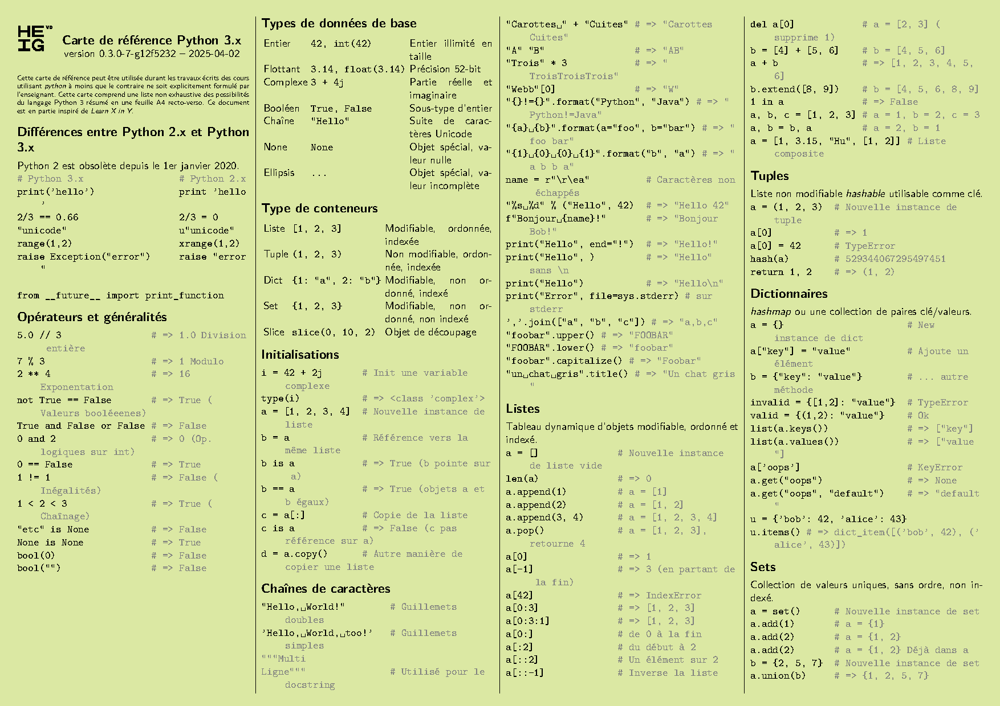

# Carte de référence Python 3.x 


Cette carte de référence est destinée à accompagner l'étudiant durant ses études d'ingénieur. Elle est en principe autorisée durant les travaux écrits et examens ; à confirmer par le professeur en charge de dispenser la matière.

## Preview

La carte de référence est une feuille A4 recto-verso supposément imprimée sur du papier 120g satiné vert :

[](https://github.com/heig-tin-info/refcard-python/releases/latest/download/refcard-python.pdf)

L'impression via la reprographie de l'école peut être demandée avec la description suivante: 

```
papier: A4 120g satiné vert
format: recto-verso, reliure petit-côté à gauche
```

## Build

L'écosystème de compilation s'appuie sur Docker, la compilation est automatique à chaque commit depuis les GitHub Actions.

Une compilation locale est possible avec les outils suivants: 

- texlive-full
- latexmk
- git