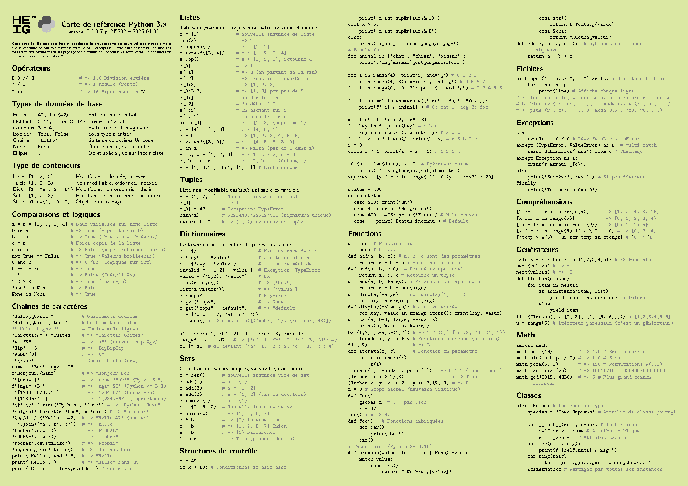

# Carte de référence Python 3.x pour étudiants


Cette carte de référence est destinée à accompagner l'étudiant durant ses études d'ingénieur. Elle est en principe autorisée durant les travaux écrits et examens ; à confirmer par le professeur en charge de dispenser la matière.

## Preview

La carte de référence est une feuille A4 recto-verso supposément imprimée sur du papier cartonné verte :

[](https://github.com/heig-tin-info/refcard-python/releases/latest/download/refcard-python.pdf)

## Build

L'écosystème de compilation s'appuie sur Docker. Vous devez avoir installé docker sur votre machine pour pouvoir compiler cette carte de référence.

```
make
```
